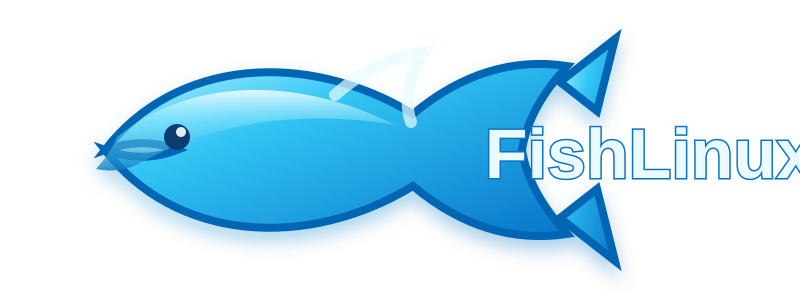

<div align="center">
  

  <h1>🐟 FishLinux</h1>

  <p><strong>An Ubuntu-based Linux experiment with a glossy Aero soul.</strong></p>

  <p>FishLinux is a personal Linux distribution project built on Ubuntu 26.04 LTS, mixing a modern Linux foundation with the glass, gradients, reflections, and playful energy of the Aero era.</p>

  <p>
    
    
    
  </p>
</div>

## 🌊 What is FishLinux?

FishLinux is an experimental Ubuntu-based distro focused on creating a desktop that feels **fun, polished, nostalgic, and unmistakably FishLinux**.

The project combines a current Ubuntu LTS base with a custom visual identity inspired by the glossy glass aesthetic of the Aero era. Think translucent surfaces, blue/cyan gradients, soft highlights, reflections, rounded UI, and plenty of aquatic personality. 🫧

## ✨ Design direction

- 🐟 Fish-themed branding
- 🫧 Glossy glass and translucent surfaces
- 💎 Blue and cyan Aero-inspired gradients
- 🌊 Soft highlights, reflections, and rounded forms
- 🖥️ A modern Linux foundation underneath the retro-inspired appearance

## 🏗️ Build system

FishLinux is being built around **Ubuntu 26.04 LTS (Resolute Raccoon)**.

The repository currently contains a GitHub Actions build scaffold that prepares Linux image-building tools and produces a starter FishLinux root filesystem artifact. The builder will grow into a real bootable ISO as the desktop, packages, installer, artwork, and system configuration are developed.

## 📁 Project layout

```text
FishLinux/
├── branding/
│   └── fishlinux-aero.svg
├── build/
├── .github/
│   └── workflows/
│       └── build-iso.yml
└── README.md
```

## 🚧 Status

**Experimental / early development** 🐟

FishLinux is currently a foundation for building the distro rather than a finished daily-driver operating system.

More fish. More glass. More Linux. 🌊🐟